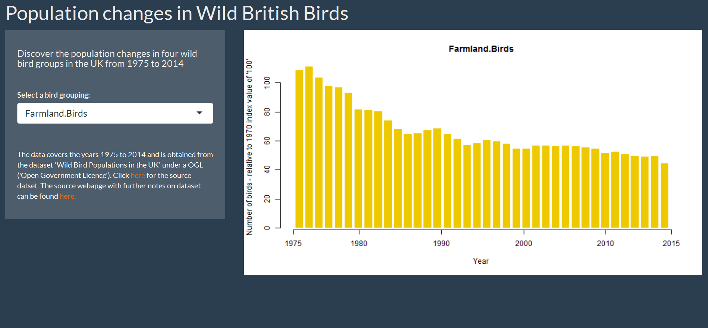

Developing Data Products - Final Project Presentation
========================================================
author: Aled Evans
date: 20 October 2016
autosize: true
font-family: "Calabri"


Introduction
========================================================

- This document briefly describes the Shiny web application used to discover the changes in population of four groups of British wild birds in the period 1975 to 2014. 

- The data is from 'Wild Bird Populations in the UK' (publsihed by the Uk Government). For the source webapge - including notes on dataset and the dataset for download - click here: [Link to data.gov.uk](https://data.gov.uk/dataset/wild_bird_populations/resource/16bcd620-c404-47ed-8cda-5315b24bf0c5)

- Notes for the data processing can be found in the file: uk-bird-data-4-groups.R. This file can be viewed in the github repository for this project: [Link to github]()


The Application
========================================================

The bird population numbers selected using the 'selectInput' dropdown input.



R code for the plot
========================================================

The barplot is computed with this code: 

```r
output$plot1 <- renderPlot({
        birdtype = input$birdtype
        barplot(birdData[, birdtype], main = birdtype, ylab="Number of birds - relative to 1970 index value of '100'", xlab="Year", col="gold2", border="white", xaxt = "n")
        axis(side=1, at=c(0, 8, 18, 28, 38, 46), labels=c("1975","1980","1990","2000", "2010", "2015"))
        })
```


Application Installation
========================================================


Download these files from gitub to run the app on your computer:

1. ui.R
2. server.R
3. uk-bird-data-4-groups.R

Save all three files in a new directory. Open the files in RStudio (or another IDE used for R programming). To run the app type the following code into the console:


```r
library(shiny)
runApp()
```

